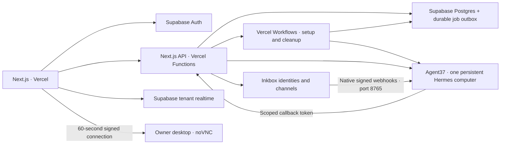

# Potato Potential

An invite-only personal agent beta: one customer, one named companion, one persistent Agent37 computer. Built with Next.js and Vercel Workflows, Supabase, and the Dots desktop / Instinct Inkbox recipes. Original SVG companions and a playful workspace cover Chat, Tasks, Wiki, Routines, Apps, and Settings.

The shared headers use the supplied Potato Potential wordmark, with empty transparent margins trimmed for readable sizing. The supplied mascot cluster provides the browser and phone home-screen icons. Public page titles, the footer, connection confirmation, and invitation emails use Potato Potential branding.

Social sharing uses an imagegen-created mascot card with Open Graph and X large-image metadata. Search metadata uses the production custom domain, a feature-focused description, structured data, and a homepage-only sitemap. The public introduction is present in the initial HTML; sign-in, operator and connection pages carry noindex metadata. See [the social card and generation prompt](docs/social-card.md).

Production: [potato-potential.rgbknights.com](https://potato-potential.rgbknights.com). Both the Vercel and Supabase projects are named `potato-potential`. The custom domain uses a Cloudflare DNS-only CNAME and Vercel HTTPS. Sign-in callbacks and agent workspace callbacks use this origin. Non-secret deployment identifiers are recorded in `infra/deployment.json`.

## Run the local preview

Requires Node 24 and npm.

```sh
npm ci
npm run demo
```

Open http://localhost:3000. The preview uses mock providers and temporary in-memory records. It sends no external messages and creates no agent instances. The sidebar's **Try agent onboarding** starts the resumable setup preview. Preview authentication is explicitly rejected when the control plane runs in production or Vercel.

```sh
npm run typecheck
npm test
npx playwright install chromium
npm run test:browser
npm run build
```

Adapter/API/lifecycle tests cover retry after lost creates, introduction replay, partial deletion, callbacks, record ownership, desktop tokens, SSE decoding/replay, timezone schedules, native memory conflicts, SMS consent, budget exhaustion, and archive-before-delete. Database tests execute the complete migration in embedded Postgres (PGlite), including real RLS and leases. Browser tests use mock providers and exercise dropped-stream recovery; screenshots and traces appear in `test-results/`.

Recovery tests also cover transactional invitation acceptance, re-invitation after deletion, leased phone-code refreshes, frozen onboarding inputs, cold-wake timeouts, persisted pause/resume intent, delayed takeover cancellation, and retrying bootstrap after a lost result without requesting signing-key rotation.

## Architecture



The web app gets public Supabase credentials and the HTTPS control-plane URL only. Administrative Agent37/Inkbox/Supabase keys are sensitive production environment variables used only by Vercel functions. All customer APIs validate a Supabase access token with `getUser`, require a verified email and an accepted invitation, and derive ownership from that account. Agent callbacks authenticate separately against the registered instance's token hash. The database permits tenant-owned reads and service-only writes; secret-bearing provisioning records have no browser policy.

The control plane queues setup/cleanup in the service-only `application_jobs` Postgres outbox before starting a Vercel workflow. Each provisioning phase runs as a bounded step. Database dispatch and worker leases deduplicate interrupted deliveries; expired work is repaired by the daily Vercel cron or while the owner checks setup. The daily sweep and workspace/routine activity also reconcile native cron history. Long chat connections rotate within four minutes and automatically replay the same response, while Hermes keeps executing on Agent37. Closing a viewer releases its HTTP connection without cancelling its turn. Execution, native persona/memory, working files, managed models, integrations, and approvals live entirely on Agent37. Database leases serialize per-customer lifecycle operations; setup saves identifiers/credential ciphertext before remote calls and reconciles resources after dropped results. Transient scoped credentials use AES-256-GCM and are dropped after configuration succeeds.

The installed `~/.boundless/workspace.mjs` supports `list`, JSON-on-stdin `save`, and `notify`. It can update only its registered customer's workspace. `SOUL.md` edits replace a marked application block while retaining existing native content. File saves carry the provider's exact modification time. The application never replaces Hermes' approval configuration or Inkbox's approval handling.

Platform crons wake sleeping agents. Routines created by the agent appear alongside app-created routines. Fired date-pinned crons are archived before deletion; genuinely yearly crons must have a name starting with `Yearly`. A started run is not evidence of success: the UI separately reports a running/finished/unknown turn and links its transcript. A finished turn can still contain blocked or unsuccessful work. One-time UI reminders are limited to the next 364 days because platform schedules have no year field.

Desktop access uses the documented visible Chromium/CDP/Xvfb/noVNC recipe. Take over requests cancellation of the active web-chat response, waits until the session has no active response, then enables mouse/keyboard input. A delayed or failed cancellation keeps the viewer read-only. Return control restores view mode and adds browser handoff context to the next message. Hiding or closing the viewer disconnects it. Native channel work follows Hermes' own concurrency and approval behavior.

Invitation acceptance inserts the customer and consumes the token in one service-only Postgres transaction. Tokenless acceptance retries preserve the existing profile. A deleted customer needs a new operator approval and token; historical consumed tokens remain closed to new accounts. Onboarding inputs become immutable when identity provisioning starts; use Retry to resume. Phone-code refreshes share the lifecycle lease. Pause/resume requests persist intent and queue reconciliation before contacting Agent37; customer APIs, provisioning, maintenance and workspace callbacks remain blocked until resume is confirmed healthy.

Agent37 calls allow 200 seconds for cold wakes. Provisioning uses the existing customer lease. Inkbox bootstrap retries reuse the same scoped credential and the native plugin's saved signing key, without requesting key rotation. A retry can rerun setup after a lost exec result; a remote key whose local copy is missing requires native human recovery rather than automatic rotation.

Before deploying these recovery changes to a new environment, apply `supabase/migrations/202610060001_atomic_invitation_acceptance.sql`. It adds the service-only `accept_invitation` RPC; deploying the API first would leave new invitation acceptance unavailable. The migration and recovery changes are deployed in production, with RPC execution denied to anonymous and authenticated clients and granted only to the service role.

The published `boundless-hermes-desktop@4` template is recorded in `infra/desktop/release.json`. Its boot helper opens and maximizes a visible Chromium window through local CDP while retaining the persisted profile and existing work tabs. Live smoke checks passed for startup rendering, an authenticated portrait noVNC connection, view/control switching, disconnection, pinned Inkbox plugin activation, and native file modification-time conflicts. The landscape-to-portrait update and restart retained a saved home file, and a dropped update reply reconciled without a second provider call. Temporary validation computers were deleted afterwards.

The operator's **Settings → Their computer** card has separate **Restart computer** and **Update computer** controls. Restart keeps the installed template; Update applies the server's approved `DESKTOP_TEMPLATE` pin and includes a restart. Customers cannot submit template names or computer IDs. Confirming saves an operation before queuing its durable job; reopening Settings shows progress. A dropped provider reply is checked against the installed template and boot fingerprint rather than issuing another restart. Active web responses block maintenance, and account deletion or suspension prevents it.

Computer updates use the existing durable reconciliation outbox and require only a new Vercel deployment. The worker holds the customer lease through job completion, preventing an overlapping routine reconciliation from losing a requested update. The current production deployment is recorded separately in `infra/deployment.json`.

The portrait desktop uses a 540 × 1140 screen (9:19), maximized visible Chromium, and a matching noVNC viewing area. This is a narrow desktop browser, without phone user-agent or touch emulation. Chromium's 500-pixel minimum window width makes a 450-pixel screen clip the browser. An image update preserves `/home/node` and `/home/linuxbrew`, including native memory and the persisted browser profile, while resetting software outside those home folders. Unsaved browser forms and work in other channels can be interrupted.

## Configure the live beta

1. Copy `.env.example` to `.env` for local live development. Supply all missing credentials. Generate `PROVISIONING_ENCRYPTION_KEY` with `node -e "console.log(require('crypto').randomBytes(32).toString('hex'))"`; retain this key across deploys so setup can resume.
2. Create a Supabase project. Apply all SQL files in `supabase/migrations` in order through the SQL editor or Supabase migration tooling. Production has them applied and recorded in `supabase_migrations`. Runtime jobs use the Supabase HTTPS API and require no database password or direct Postgres connection. For Management API migration tooling, keep a project-scoped `SUPABASE_ACCESS_TOKEN` in the ignored local `.env` with Migrations read-write and Database read permissions. `DATABASE_URL` is optional for direct Postgres migration tooling.
3. Enable Supabase email authentication and configure production SMTP. Add your web origin and `<WEB_ORIGIN>/auth/callback` to allowed redirect URLs. Users must sign in through a verified email magic link. This deployment uses Resend SMTP over STARTTLS on port 587, with `noreply@factory.rgbknights.com` as the sender. The Resend key is held in Supabase's encrypted SMTP configuration, the ignored local `.env`, and a server-only Vercel secret for invitation emails. Apply the branded [sign-in email design](supabase/templates/README.md) to both the Magic link or OTP and Confirm sign up templates after deploying its public logo asset.
4. Build the pinned desktop template with `npm run release:agent`, using `AGENT37_API_KEY` in the environment. Set `DESKTOP_TEMPLATE` to the tested published revision (for example `boundless-hermes-desktop@4`). The Dockerfile pins Hermes `2026.10.05a` and Inkbox plugin commit `753a623…`; each published template revision freezes the resulting image and installed SDK. Updating the source and rebuilding publishes a new revision; existing agents keep their pin until Update computer is confirmed.
5. Deploy from the monorepo root with Vercel CLI. Use project name `potato-potential`, root directory `apps/web`, Node 24, install command `npm ci --prefix ../..`, build command `npm run build`, and enable source files outside the root directory. `apps/web/vercel.json` configures bounded functions and a daily authenticated maintenance cron.
6. Set the production server variables from `.env.example` on Vercel, including `WEB_ORIGIN`, `PUBLIC_CONTROL_URL`, provider/admin keys, `OPERATOR_EMAILS`, encryption key, `CONTROL_RUNTIME=workflow`, and a random `CRON_SECRET`. Make provider keys, encryption key, service key, and cron secret sensitive variables. Set `DEMO_MODE=false` and `NEXT_PUBLIC_DEMO_MODE=false`. Public Supabase URL/key are the only credentials needed by the browser; `NEXT_PUBLIC_CONTROL_URL` may be omitted to use the same origin. Keep `.env` ignored; `.worktreeinclude` copies it into managed worktrees.
7. Sign in at `/signin` with the configured operator email. The verified operator can create their own companion without a customer invitation. Visit `/operator/invitations` to review beta requests and approve invitations, including while companion setup is in progress. Adding an email saves it for review; **Approve & invite** registers access and sends the invitation. The page shows requests, delivery/acceptance, and current Supabase Auth account existence, with one row per email. Failed sends retry the same registered invitation. The **Beta operator** navigation link appears only after setup completes and only for that account; customer accounts are denied by the server even when calling the operator API directly. Set server-only `RESEND_API_KEY` and `INVITATION_FROM_EMAIL` to use the existing verified sender. Links expire after seven days and remain consumed after customer deletion. `/operator` keeps the companion health, budgets, suspension and recovery controls on a separate page, including the legacy manual-link creation option.

The Apps adapter maps the Agent37 items response into the application toolkits contract. Catalog search requires at least three characters; clearing it browses the full catalog. First-page errors offer retry, pagination preserves loaded apps on failure, and stale page responses cannot overwrite a newer search. Live owner checks passed for 24 initial apps, 24 additional apps, Gmail search and the connections contract.

Onboarding includes an accessible country selector and phone control that formats numbers while typing, accepts pasted international formatting, and converts local numbers for the selected country. Inline errors catch incomplete numbers. The shared server contract normalizes complete international numbers to E.164 and rejects missing country codes, unknown calling codes, impossible lengths, and extensions. Native inbound phone confirmation still establishes ownership; format validation cannot do that.

The default managed-service monthly cap is **US$5**, adjustable by the operator. It bounds Agent37 managed model/search/connector usage; compute and Inkbox costs are separate. Fund the Agent37 wallet independently. The operator can inspect hosting health/usage, suspend with an explicit platform stop, resume, retry provisioning, and retry incomplete cleanup.

Public visitors join the beta list at `/` without creating an Auth account or agent. Existing invited users are retained by migration `202610050003`. The new `beta_requests` table has RLS and grants access only to the service role. Passwordless email sign-in lives at `/signin`; Supabase verifies the email before the app can claim an active invitation for it. Signup alone never grants provisioning access.

Keep `ENABLE_SMS=false` unless dedicated SMS provisioning is enabled for your Inkbox account. When true, setup reconciles/provisions one US local number for the identity and shows its SMS readiness. The owner must send `START` and the inbound verification code from their supplied number. Otherwise use Instinct's recipient-initiated iMessage connection. Native Inkbox bootstrap installs signed webhooks and hosted voice without widening contact-scoped authority. Hosted calls send their transcript/follow-up to Hermes afterwards; they do not read live Hermes memory.

Conversation references are stored independently of the provider's recent-session list. Web replay uses response IDs; after reload the app discovers `active_response_id` and offers Reconnect. Expired replay falls back to session history. Archive and scheduled session references survive cron deletion. Call transcripts are shown only after membership in the authenticated owner's identity call list is established.

Account deletion runs as a retryable job. An instance delete and an identity delete are acknowledged independently. Ownership records stay until both succeed; then Supabase Auth deletion cascades the customer workspace. Operators can retry failures from the beta screen.

## Live acceptance checks

Full beta validation requires Inkbox credentials, Supabase configuration, public HTTPS web/control-plane URLs, an SMS-enabled account when testing SMS, and a consenting owner phone. The mock tests do not establish external channel delivery or wake-from-sleep behavior.

With `AGENT37_API_KEY` set, run `npx tsx scripts/live-agent-smoke.ts` to repeat the desktop/plugin/file check. It creates a temporary instance with a zero-dollar managed-service cap, opens its real desktop, and removes the instance in a cleanup block. It does not create an Inkbox identity or send external messages.

Run `npx tsx scripts/live-computer-maintenance.ts` with the same key to validate the landscape-to-portrait update, lost-reply reconciliation, restart, retained home files, actual Chromium viewport and noVNC framebuffer on a temporary computer. The script deletes the computer in its cleanup block and records its ownership in `.cache/live-computer-maintenance.json` before and after provider calls.

- Complete onboarding, interrupt/retry each phase, and verify one provider computer and identity.
- Use two verified invited accounts to check database, session, file, callback, connector, call, and desktop ownership.
- Send/reconnect/cancel web chat; exchange iMessage/email and enabled SMS; call the hosted line and verify the transcript reaches Hermes.
- Ask Hermes to create a dated reminder, let its instance sleep, and verify the reminder wakes it, contacts the owner, and appears in archived history.
- Watch the real desktop, take over during browser work, return control, and verify its WebSocket closes when hidden/closed.
- Exercise native approval requests, exhausted budgets, failed connectors, workspace helper edits, memory conflicts, and resumable deletion.

The Vercel/Supabase deployment uses the project name `potato-potential`. Production infrastructure checks and full channel delivery are separate: a consenting owner still needs to complete phone verification, messaging and voice acceptance. For configured live development, run `npm run dev -w @boundless/web`; `npm run demo` starts the isolated mock API and preview.

Deployment validation on 2026-10-05 passed the production build/type check, 66 unit/adapter/database tests, and 18 browser tests, including invitation email adapters, verified operator authority, separate acceptance/account states, account pagination and lookup failures, standalone invitation access before setup and hidden setup navigation. Live checks passed HTTPS health, invitation enforcement, tenant-scoped task/wiki and conversation reads, rejected cross-tenant edits, callback authentication, operator access checks, desktop/file readiness checks, protected job records, and rejection of mock authentication. Disposable verified test accounts were created without sending email and removed after validation. A persisted Postgres job dispatched through Vercel Workflows and completed on the deployed app, including after the custom-domain configuration changed. Public HTML and loaded JavaScript contained none of the configured administrative credentials. Resend SMTP credentials authenticated over verified STARTTLS, and the invitation API key and sender domain were verified through the Resend API without sending a message; delivery and the complete phone/channel flows still need owner acceptance.

The computer maintenance release passed GitHub CI and live computer maintenance validation. A temporary registered computer updated from the landscape template to `boundless-hermes-desktop@4` and restarted through the deployed Vercel reconciliation workflow. Both operations confirmed the 540 × 1140 desktop and a retained home file; customer access to operator maintenance endpoints was rejected. The temporary computer, Auth customer and jobs were removed. Maintenance uses the existing database outbox, so no additional Supabase migration or management login was required for that release.

The beta signup release passed GitHub CI with 71 unit/adapter/database tests and 21 browser tests. Migration `202610050003` is installed in production. Live checks verified normalized duplicate signup, no signup-created invitation or customer, denied anonymous/authenticated database access, operator-only review controls, and verified email invitation acceptance without browser token storage. Temporary beta requests, invitations and Auth fixtures were removed. Published desktop/mobile pages and the native Supabase PKCE sign-in request passed; OTP transport was intercepted without sending an email. The signed-in operator's review page and the custom domain's deployment were verified. Real invitation and sign-in email delivery remain covered by the configured Resend transport and need recipient acceptance.

The security recovery release passed GitHub CI with 89 unit/adapter/database tests and 25 browser tests. Live checks confirmed server-only RPC privileges, atomic invalid-invitation rollback, profile-preserving acceptance retries, denied operator access for customers, and a fresh invitation requirement after account deletion even when the new account uses the same email. Temporary fixtures were removed without sending email or creating provider computers. Pause/resume, phone-code locking, frozen onboarding, cold-wake timing, delayed takeover and bootstrap signing-key reuse were checked with mock providers. The existing desktop image remains sufficient. Production dependency audit is clean; the full development dependency audit reports [GHSA-pqg4-j6r4-53mv](https://github.com/advisories/GHSA-pqg4-j6r4-53mv) through `concurrently` / `shell-quote`, with the fix available in `shell-quote` 1.11.0.

## References

- [Agent37 context](https://www.agent37.com/docs/llms-full.txt)
- [Dots desktop and takeover](https://www.agent37.com/docs/agents-api/dots#watch-and-take-over-its-computer)
- [Dots recipe source](https://github.com/agent37-platform/examples/tree/main/custom-images/hermes-vnc-desktop)
- [Instinct implementation](https://github.com/agent37-platform/examples/tree/main/instinct)
- [Inkbox Hermes plugin](https://github.com/inkbox-ai/hermes-agent-plugin)
- [Town workspace inspiration](https://www.town.com/)
