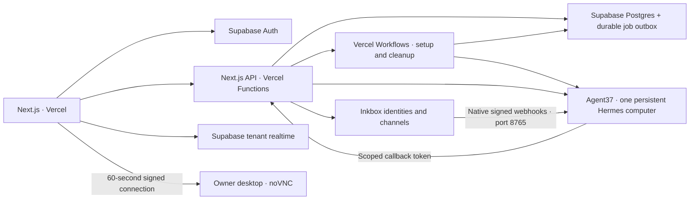

# Potato Potential

An invite-only personal agent beta: one customer, one named companion, one persistent Agent37 computer. Built with Next.js and Vercel Workflows, Supabase, and the Dots desktop / Instinct Inkbox recipes. Original SVG companions and a playful workspace cover Chat, Tasks, Wiki, Routines, Apps, and Settings.

The shared headers use the supplied Potato Potential wordmark, with empty transparent margins trimmed for readable sizing. The supplied mascot cluster provides the browser and phone home-screen icons. Public page titles, the footer, connection confirmation, and invitation emails use Potato Potential branding.

Social sharing uses an imagegen-created mascot card with Open Graph and X large-image metadata. Search metadata uses the production custom domain, a feature-focused description, structured data, and a homepage-only sitemap. The public introduction is present in the initial HTML; sign-in, operator and connection pages carry noindex metadata. See [the social card and generation prompt](docs/social-card.md).

Production: [potato-potential.rgbknights.com](https://potato-potential.rgbknights.com). Both the Vercel and Supabase projects are named `potato-potential`. The custom domain uses a Cloudflare DNS-only CNAME and Vercel HTTPS. Sign-in callbacks and agent workspace callbacks use this origin. Non-secret deployment identifiers are recorded in `infra/deployment.json`.

## Run the local preview

Requires Node 24 and npm.

```sh
npm ci
npm run demo
```

Open http://localhost:3000. The preview uses mock providers and temporary in-memory records. It sends no external messages and creates no agent instances. The sidebar's **Try agent onboarding** starts the resumable setup preview. Preview authentication is explicitly rejected when the control plane runs in production or Vercel.

```sh
npm run typecheck
npm test
npx playwright install chromium
npm run test:browser
npm run build
```

Adapter/API/lifecycle tests cover retry after lost creates, introduction replay, partial deletion, callbacks, record ownership, desktop tokens, SSE decoding/replay, timezone schedules, native memory conflicts, SMS consent, budget exhaustion, and archive-before-delete. Database tests execute the complete migration in embedded Postgres (PGlite), including real RLS and leases. Browser tests use mock providers and exercise dropped-stream recovery; screenshots and traces appear in `test-results/`.

Recovery tests also cover transactional invitation acceptance, re-invitation after deletion, leased phone-code refreshes, frozen onboarding inputs, cold-wake timeouts, persisted pause/resume intent, delayed takeover cancellation, and retrying bootstrap after a lost result without requesting signing-key rotation.

## Architecture

Chat supports immediate file uploads (button, drop, or paste), optional folders under Home (`/home/node`), and files up to **100 MB (100,000,000 bytes)**. The read-only destination opens a folder picker on the current owned computer, with breadcrumbs, parent navigation, filtering and optional hidden folders. `~` expands to `/home/node`; the default is `/home/node/uploads/`, prepared during computer setup and reconciliation. The authenticated directory endpoint uses native Files API listings and rejects symbolic-link destinations. Uploads use 2 MiB sized binary pieces through Agent37's native Files API. The service-only `file_uploads` table keeps owner/instance bindings, checksums, pieces, state, and a 24-hour expiry; bytes stay on the computer. A fixed, versioned `~/.boundless/file-upload.mjs` verifies every piece and the complete SHA-256, publishes with an atomic no-overwrite link, and recovers lost completion replies. It guards destination symlinks and overlapping assembly attempts. Native home storage retains transfers and the helper through restarts and updates.

The paperclip in the composer's bottom action row toggles the upload button and destination selector, inline with the send button. These controls start collapsed and use compact icons on mobile. Pending attachments, progress and retry/removal controls remain visible while collapsed; dropping or pasting files works without opening the controls.

Computer has Overview, Files, Requests & services, and Resource usage views. Overview contains the desktop and maintenance controls; Requests & services contains publication approvals and registered services, and request notifications open that view directly. Resource usage contains the CPU, memory and disk charts. Files follows the Agent37 starter kit's explorer pattern with Outputs, Uploads and Home shortcuts, breadcrumbs, list/grid views, hidden-file controls, previews, uploads, folder creation, rename/delete and folder archives. Browsing is limited to persistent storage and excludes application-managed `.boundless` paths. Renames never overwrite another name; rename/delete check the displayed modification time and refuse folders with unfinished uploads. Previews are limited to 20 MB, text is escaped, and HTML/SVG render in sandboxed frames. Archives stream through the existing authenticated download route using `archive=1`. File-browser uploads reuse verified resumable transfers with `purpose: files`, keeping them separate from chat attachments; this is stored in the existing JSON upload record and needs no new migration. Backup controls are deferred.

Completed uploads remain selected until `response.created` accepts the next turn. The response API verifies each regular file on the current owned computer, then forwards the exact saved paths in the native `files` array alongside the existing session and response settings. Failed submissions preserve the draft and attachments; files-only turns use “I’ve uploaded these files.” Removing an attachment keeps its saved file. Resuming an interrupted upload after reload requires reselecting the original file and matching its SHA-256. Filename and download links are included in the native transcript for saved-history access.

Private downloads stream from `/api/files/content?instance=INSTANCE_ID&path=ENCODED_PATH`. Browser downloads verify the existing Supabase cookie with `getUser`; API clients retain bearer authentication. Ownership, current computer, suspension, maintenance, and deletion restrictions apply. Downloads force attachment disposition with `no-store` and `nosniff`. Signed-out browser downloads return through `/signin`, preserving the destination in the same browser across the existing passwordless callback. Links retrieve the current contents at the path; missing files and replaced computers are reported. The companion saves generated files to `~/outputs` by default and verifies existence before linking them.

Apply [the upload migration](supabase/migrations/20261007034424_file_uploads.sql) before deploying these API routes. `node --env-file=.env scripts/migrate-file-transfers.mjs apply` records it through the scoped Supabase Management API, checks service-only grants and immutable bindings, and reconciles its generated version locally. Reconciliation installs the helper and instructions on existing ready computers. `scripts/live-file-transfers.ts` exercises a 6 MB production transfer, cookie/bearer authentication, empty files, and persistence after restart/update using one disposable verified owner and zero-model-budget computer; it removes both fixtures afterward.

The file-transfer release passed 197 unit/API/database tests, 45 browser tests, type checks, and production builds. The live 6 MB transfer passed through Vercel and survived both restart and template update; an empty file under `/home/linuxbrew` also passed. Production reconciliation installed the helper and instructions on the existing ready computer while preserving its native persona, callback, and instance. Temporary computers, Auth accounts, upload records, bindings, and jobs were verified removed. The Next.js catch-all is named `route` so Vercel cannot replace the Files API's `path` query parameter with route segments.



The web app gets public Supabase credentials and the HTTPS control-plane URL only. Administrative Agent37/Inkbox/Supabase keys are sensitive production environment variables used only by Vercel functions. All customer APIs validate a Supabase access token with `getUser`, require a verified email and an accepted invitation, and derive ownership from that account. Agent callbacks authenticate separately against the registered instance's token hash. The database permits tenant-owned reads and service-only writes; secret-bearing provisioning records have no browser policy.

The control plane queues setup/cleanup in the service-only `application_jobs` Postgres outbox before starting a Vercel workflow. Each provisioning phase runs as a bounded step. Database dispatch and worker leases deduplicate interrupted deliveries; expired work is repaired by the daily Vercel cron or while the owner checks setup. The daily sweep and workspace/routine activity also reconcile native cron history. Long chat connections rotate within four minutes and automatically replay the same response, while Hermes keeps executing on Agent37. Closing a viewer releases its HTTP connection without cancelling its turn. Execution, native persona/memory, working files, managed models, integrations, and approvals live entirely on Agent37. Database leases serialize per-customer lifecycle operations; setup saves identifiers/credential ciphertext before remote calls and reconciles resources after dropped results. Transient scoped credentials use AES-256-GCM and are dropped after configuration succeeds.

The installed `~/.boundless/workspace.mjs` supports `list`, JSON-on-stdin `save`, and `notify`. Tasks and responsibilities are independent workspace records. Future conversations find them with `list` and continue from the saved details; their body should hold the goal, decisions, progress, open questions, next steps, and output paths. Include an item's id when saving to update it. Saves do not require a session id. Notifications retain the runtime `HERMES_SESSION_ID` when available to identify the originating conversation. Existing ready computers receive the updated helper and instructions during reconciliation. Apply `supabase/migrations/20261008120000_remove_task_session_links.sql` to remove legacy task conversation-link metadata while preserving task details and conversation histories.

The helper can update only its registered customer's workspace. `SOUL.md` edits replace a marked application block while retaining existing native content. File saves carry the provider's exact modification time. The application never replaces Hermes' approval configuration or Inkbox's approval handling.

**New conversation** and **Conversation history** are available in the top-right header on every workspace page. New conversation reserves a fresh web session and opens an empty chat; Hermes creates its native transcript on the first message. The history popup reopens earlier web conversations for continued messaging, while messaging-channel and routine transcripts remain read-only. The selected web conversation persists across reloads. Changes use the customer lease, refuse to switch away from an active response, and reject messages from tabs that still target an earlier selection. Retrying a lost create reply reuses the same session id. Unsent text drafts are retained per web conversation while the workspace stays open. This uses the existing conversation records and requires no new database migration.

Platform crons wake sleeping agents. Routines created by the agent appear alongside app-created routines. Fired date-pinned crons are archived before deletion; genuinely yearly crons must have a name starting with `Yearly`. A started run is not evidence of success: the UI separately reports a running/finished/unknown turn and links its transcript. A finished turn can still contain blocked or unsuccessful work. One-time UI reminders are limited to the next 364 days because platform schedules have no year field.

Each routine has an Edit action. The editor and `PATCH /api/routines/:id` support name, prompt, schedule, timezone, enabled, agent, and profile. Only changed fields are sent; name and prompt edits preserve the next firing, while schedule, timezone, or enabled changes recalculate it. Agent/profile accept `null` to return to their defaults, and background sync preserves explicit choices. Profiles require Hermes. Updates hold the owner lease, retain the native routine ID and archived check-ins, and preserve app-added notification instructions. A rescheduled dated reminder is retained until it has fired on its new date and time.

Desktop access uses the documented visible Chromium/CDP/Xvfb/noVNC recipe. Take over requests cancellation of the active web-chat response, waits until the session has no active response, then enables mouse/keyboard input. A delayed or failed cancellation keeps the viewer read-only. Return control restores view mode and adds browser handoff context to the next message. Hiding or closing the viewer disconnects it. Native channel work follows Hermes' own concurrency and approval behavior.

Invitation acceptance inserts the customer and consumes the token in one service-only Postgres transaction. Tokenless acceptance retries preserve the existing profile. Account erasure removes that customer's invitations and beta records; returning customers need a new operator approval and token, and their old tokens cannot be reused. Onboarding inputs become immutable when identity provisioning starts; use Retry to resume. Phone-code refreshes share the lifecycle lease. Pause/resume requests persist intent and queue reconciliation before contacting Agent37; customer APIs, provisioning, maintenance and workspace callbacks remain blocked until resume is confirmed healthy.

Agent37 calls allow 200 seconds for cold wakes. Provisioning uses the existing customer lease. Inkbox bootstrap retries reuse the same scoped credential and the native plugin's saved signing key, without requesting key rotation. A retry can rerun setup after a lost exec result; a remote key whose local copy is missing requires native human recovery rather than automatic rotation.

Before deploying these recovery changes to a new environment, apply `supabase/migrations/202610060001_atomic_invitation_acceptance.sql`. It adds the service-only `accept_invitation` RPC; deploying the API first would leave new invitation acceptance unavailable. The migration and recovery changes are deployed in production, with RPC execution denied to anonymous and authenticated clients and granted only to the service role.

The published `boundless-hermes-desktop@4` template is recorded in `infra/desktop/release.json`. Its boot helper opens and maximizes a visible Chromium window through local CDP while retaining the persisted profile and existing work tabs. Live smoke checks passed for startup rendering, an authenticated portrait noVNC connection, view/control switching, disconnection, pinned Inkbox plugin activation, and native file modification-time conflicts. The landscape-to-portrait update and restart retained a saved home file, and a dropped update reply reconciled without a second provider call. Temporary validation computers were deleted afterwards.

The **Computer** page gives each owner **Restart computer** and **Update computer** controls. Restart keeps the installed template; Update applies the server's approved `DESKTOP_TEMPLATE` pin and includes a restart. Customers cannot submit template names or computer IDs. Confirming saves an operation before queuing its durable job; reopening Computer shows progress. A dropped provider reply is checked against the installed template and boot fingerprint rather than issuing another restart. Active web responses block maintenance, and account deletion or suspension prevents it.

Computer updates use the existing durable reconciliation outbox and require only a new Vercel deployment. The worker holds the customer lease through job completion, preventing an overlapping routine reconciliation from losing a requested update. The current production deployment is recorded separately in `infra/deployment.json`.

The portrait desktop uses a 540 × 1140 screen (9:19), maximized visible Chromium, and a matching noVNC viewing area. This is a narrow desktop browser, without phone user-agent or touch emulation. Chromium's 500-pixel minimum window width makes a 450-pixel screen clip the browser. An image update preserves `/home/node` and `/home/linuxbrew`, including native memory and the persisted browser profile, while resetting software outside those home folders. Unsaved browser forms and work in other channels can be interrupted.

## Computer and service links

Computer combines the desktop preview, owner maintenance controls, and 24-hour CPU, memory, and disk metrics. The Chat preview remains available. Status and metrics use the Hosting API; connecting the desktop or explicitly checking/publishing a service can wake the computer.

Services are registered by port, either by their owner or by an agent link request. Signed previews offer 15 minutes, one hour (default), 24 hours, or seven days. They cannot be revoked early. Public links have a random hostname and remain accessible until disabled; public traffic can keep the computer awake. Disabling a public link leaves signed access valid until its expiry. Platform, desktop, browser-debugging, Inkbox, and channel ports are protected.

Agents use the existing instance callback credential through `~/.boundless/computer.mjs`:

```sh
echo '{"port":8788,"label":"Project preview","reason":"Preview the page I built","kind":"signed","ttl_seconds":3600}' | node ~/.boundless/computer.mjs request
node ~/.boundless/computer.mjs status REQUEST_ID
```

Use `kind: "public"` without `ttl_seconds` for a permanent public link. The helper prints the request ID before submission; retain it and include `id` in the same JSON when retrying. `status` without an ID recovers recent requests. Every agent request requires owner approval in Computer. The owner sees one in-app notification; the agent retrieves the decision and approved URL through the authenticated callback.

Apply `supabase/migrations/20261006205153_computer_services.sql` before deploying this feature. Its records are server-only, signed URLs are encrypted, and account deletion cascades them after provider cleanup. The existing reconciliation workflow installs the helper and refreshes the managed persona on ready computers without replacing their instance or custom persona content.

For an isolated live provider check, bundle `scripts/live-computer-services.ts` with esbuild and run it with the ignored project environment. It creates one temporary, zero-model-budget computer, verifies service probing, signed/public access, public removal, and metrics, then deletes it. It sends no external messages and prints no access URLs or credentials.

## Configure the live beta

1. Copy `.env.example` to `.env` for local live development. Supply all missing credentials. Generate `PROVISIONING_ENCRYPTION_KEY` with `node -e "console.log(require('crypto').randomBytes(32).toString('hex'))"`; retain this key across deploys so setup can resume.
2. Create a Supabase project. Apply all SQL files in `supabase/migrations` in order through the SQL editor or Supabase migration tooling. Applied production migrations are recorded in `supabase_migrations`. Runtime jobs use the Supabase HTTPS API and require no database password or direct Postgres connection. For Management API migration tooling, keep a project-scoped `SUPABASE_ACCESS_TOKEN` in the ignored local `.env` with Migrations read-write and Database read permissions. `DATABASE_URL` is optional for direct Postgres migration tooling.
3. Enable Supabase email authentication and configure production SMTP. Add your web origin and `<WEB_ORIGIN>/auth/callback` to allowed redirect URLs. Users must sign in through a verified email magic link. This deployment uses Resend SMTP over STARTTLS on port 587, with `noreply@factory.rgbknights.com` as the sender. The Resend key is held in Supabase's encrypted SMTP configuration, the ignored local `.env`, and a server-only Vercel secret for invitation emails. Apply the branded [sign-in email design](supabase/templates/README.md) to both the Magic link or OTP and Confirm sign up templates after deploying its public logo asset.
4. Build the pinned desktop template with `npm run release:agent`, using `AGENT37_API_KEY` in the environment. Set `DESKTOP_TEMPLATE` to the tested published revision (for example `boundless-hermes-desktop@4`). The Dockerfile pins Hermes `2026.10.05a` and Inkbox plugin commit `753a623…`; each published template revision freezes the resulting image and installed SDK. Updating the source and rebuilding publishes a new revision; existing agents keep their pin until Update computer is confirmed.
5. Deploy from the monorepo root with Vercel CLI. Use project name `potato-potential`, root directory `apps/web`, Node 24, install command `npm ci --prefix ../..`, build command `npm run build`, and enable source files outside the root directory. `apps/web/vercel.json` configures bounded functions and a daily authenticated maintenance cron.
6. Set the production server variables from `.env.example` on Vercel, including `WEB_ORIGIN`, `PUBLIC_CONTROL_URL`, provider/admin keys, `OPERATOR_EMAILS`, encryption key, `CONTROL_RUNTIME=workflow`, a random `CRON_SECRET`, and an independent random `BETA_ACCESS_TOKEN`. Make provider keys, encryption key, service key, cron secret, and beta access token sensitive variables. Set `DEMO_MODE=false` and `NEXT_PUBLIC_DEMO_MODE=false`. Public Supabase URL/key are the only credentials needed by the application's sign-in flow; `NEXT_PUBLIC_CONTROL_URL` may be omitted to use the same origin. Keep `.env` ignored; `.worktreeinclude` copies it into managed worktrees.
7. Open `/beta` and enter `BETA_ACCESS_TOKEN` to review and search beta requests without a user account. The token is sent in an Authorization header and retained only in the current tab's session storage; **Lock beta list** removes it. Missing or incorrect tokens are denied by the server, and user/operator credentials grant no beta access. The page has no main-application links or menu entry, is excluded from the sitemap, and is marked noindex/nofollow. **Approve & invite** is available only for requested emails without an existing user account. The server checks every Supabase Auth page immediately before approval, including users who have not enrolled, and blocks invitation delivery if lookup fails. Simultaneous approvals and delivery retries reuse a single registered invitation; already-sent active invitations are not sent again. Set server-only `RESEND_API_KEY` and `INVITATION_FROM_EMAIL` for invitation emails. Links expire after seven days and are invalidated on account erasure. `/operator` retains companion health, budgets, suspension, and recovery controls, protected by the configured verified operator account.

The Apps adapter maps the Agent37 items response into the application toolkits contract. Catalog search requires at least three characters; clearing it browses the full catalog. First-page errors offer retry, pagination preserves loaded apps on failure, and stale page responses cannot overwrite a newer search. Live owner checks passed for 24 initial apps, 24 additional apps, Gmail search and the connections contract.

Onboarding includes an accessible country selector and phone control that formats numbers while typing, accepts pasted international formatting, and converts local numbers for the selected country. Inline errors catch incomplete numbers. The shared server contract normalizes complete international numbers to E.164 and rejects missing country codes, unknown calling codes, impossible lengths, and extensions. Native inbound phone confirmation still establishes ownership; format validation cannot do that.

The default managed-service monthly cap is **US$5**, adjustable by the operator. It bounds Agent37 managed model/search/connector usage; compute and Inkbox costs are separate. Fund the Agent37 wallet independently. The operator can inspect hosting health/usage, suspend with an explicit platform stop, resume, retry provisioning, and retry incomplete cleanup.

Public visitors join the beta list at `/` without creating an Auth account or agent. The `beta_requests.email` primary key provides a unique index, and signup normalizes email case/whitespace and ignores duplicates without resetting approval or delivery records. Beta requests have no Auth owner or approver. The table has RLS and grants access only to the service role. Passwordless email sign-in lives at `/signin`. Before requesting any email, it calls the server's `POST /api/auth/signin` approval check. Unknown emails, waitlisted applicants, expired invitations, and unapproved Auth-only records are rejected on the login form. Accepted customers, active approved invitees, and configured operators are allowed. For an unverified address, the server prepares the Auth user without confirming it, generates an admin invite token, and sends its single-use sign-in link through Resend. The browser receives only `{ ready: true, emailSent: true }` and does not request public OTP. The `/auth/callback` route redeems the invite token through `verifyOtp` and persists the verified session cookie. Already verified users retain the existing browser OTP and PKCE callback with `shouldCreateUser: false`. Supabase still verifies the email before invitation acceptance. Existing Auth-only records do not count as accepted users or prevent beta approval.

Production has public Supabase Auth signup disabled. In another environment, deploy the sign-in approval route and admin invite callback before disabling public signup so direct calls with the public key cannot create unapproved users. `node --env-file=.env scripts/configure-invite-only-auth.mjs` inspects the setting; append `apply` to set and verify `disable_signup: true` using a project-scoped Management API token with Auth configuration access. Public OTP treats existing unverified users as signups, so they require the admin invitation flow until their email is verified. Neither preparation nor mail delivery confirms the address, creates a customer profile, accepts beta, or exposes an Auth token in the API response.

The `/beta` page offers **Remove from beta list** for people who have not accepted and **Close account** for accepted users. Removal revokes pending invitations and deletes any unaccepted Auth-only record. Account closure requires confirmation and follows the same provider cleanup as the owner's account settings. The beta entry stays visible as **Closing account** until cleanup succeeds; the page refreshes automatically and offers a retry. The token-protected `DELETE /api/beta/requests` accepts an email and requires `closeAccount: true` for an enrolled account. Account lookup failures or ambiguous ownership leave the entry and account intact. Apply `supabase/migrations/20261007135706_account_beta_cleanup.sql` before deploying this change; `node --env-file=.env scripts/migrate-account-beta-cleanup.mjs apply` records and verifies it. It removes beta entries for the Auth email, customer email, and accepted invitation emails during account erasure, including closure from the owner's settings.

The beta cleanup and sign-in gate are deployed in production. Rejected sign-in requests explicitly say **No sign-in email was sent** and offer a link to join the beta list. The production browser check verified rejection without any Auth email request, and the beta page's removal action erased the reported unaccepted Auth-only account and its beta entry. Public signup was disabled through the authenticated Supabase dashboard and verified through the Auth settings API. The production build, database checks, and 16 targeted browser tests passed.

The first-invite sign-in correction passed 244 unit/API/database tests, six relevant browser checks, typecheck, and local/Vercel production builds. Live Supabase checks with public signup disabled exercised both a new and an existing unconfirmed invitee, kept the address unverified until the deployed callback redeemed its token, and verified session cookies and rejection of a reused link. Verified users still select the original OTP flow. Test delivery was intercepted without sending recipient emails, and disposable Auth fixtures were removed. The original beta invitation remains separate from the short-lived Auth verification link.

Keep `ENABLE_SMS=false` unless dedicated SMS provisioning is enabled for your Inkbox account. When true, setup reconciles/provisions one US local number for the identity and shows its SMS readiness. The owner must send `START` and the inbound verification code from their supplied number. Otherwise use Instinct's recipient-initiated iMessage connection. Native Inkbox bootstrap installs signed webhooks and hosted voice without widening contact-scoped authority. Hosted calls send their transcript/follow-up to Hermes afterwards; they do not read live Hermes memory.

Channels uses Inkbox's router link only to connect. Once connected, shared-line messaging and calling instructions direct the owner to the contact card Inkbox sent in Messages; the shared line's number is not exposed by the API. Direct call links and phone-number copying use a provisioned dedicated number only. Channel browser tests cover connected, connection-needed, loading, unavailable, and dedicated-number states.

Conversation references are stored independently of the provider's recent-session list. Web replay uses response IDs; after reload the app discovers `active_response_id` and offers Reconnect. Expired replay falls back to session history. Archive and scheduled session references survive cron deletion. Call transcripts are shown only after membership in the authenticated owner's identity call list is established.

Account closure immediately marks the account as deleting under its lifecycle lease, blocking further workspace access and setup. A retryable job removes the user's single Agent37 instance, then their Inkbox identity, then their Supabase Auth account. Provider confirmations are persisted independently, so retries only repeat unfinished work. The stored instance ID is recovered from its owner tag if a create reply was lost; Inkbox cleanup resolves the saved identity UUID if its handle changed. Inkbox's [identity deletion](https://inkbox.ai/docs/api/identities/manage) cascades its mailbox and tunnel, revokes scoped keys, and releases the linked phone number; a failed carrier release prevents account erasure.

The Auth deletion trigger blocks erasure until both provider removals are confirmed, deletes linked invitations and beta requests, and removes the owner's lease. Foreign keys cascade customer/workspace/notification/conversation/reminder/job records and prevent delayed jobs from recreating orphan records. Failed cleanup is recovered by account polling and scheduled maintenance; the closing page also offers a retry. Successful closure clears browser sign-in. Agent37 documents a [seven-day backup retention window](https://www.agent37.com/docs/agents-api/instances) after instance deletion; immediate provider backup erasure is outside the app's control.

## Live acceptance checks

Full beta validation requires Inkbox credentials, Supabase configuration, public HTTPS web/control-plane URLs, an SMS-enabled account when testing SMS, and a consenting owner phone. The mock tests do not establish external channel delivery or wake-from-sleep behavior.

With `AGENT37_API_KEY` set, run `npx tsx scripts/live-agent-smoke.ts` to repeat the desktop/plugin/file check. It creates a temporary instance with a zero-dollar managed-service cap, opens its real desktop, and removes the instance in a cleanup block. It does not create an Inkbox identity or send external messages.

Run `npx tsx scripts/live-computer-maintenance.ts` with the same key to validate the landscape-to-portrait update, lost-reply reconciliation, restart, retained home files, actual Chromium viewport and noVNC framebuffer on a temporary computer. The script deletes the computer in its cleanup block and records its ownership in `.cache/live-computer-maintenance.json` before and after provider calls.

- Complete onboarding, interrupt/retry each phase, and verify one provider computer and identity.
- Use two verified invited accounts to check database, session, file, callback, connector, call, and desktop ownership.
- Send/reconnect/cancel web chat; exchange iMessage/email and enabled SMS; call the hosted line and verify the transcript reaches Hermes.
- Ask Hermes to create a dated reminder, let its instance sleep, and verify the reminder wakes it, contacts the owner, and appears in archived history.
- Watch the real desktop, take over during browser work, return control, and verify its WebSocket closes when hidden/closed.
- Exercise native approval requests, exhausted budgets, failed connectors, workspace helper edits, memory conflicts, and resumable deletion.

The Vercel/Supabase deployment uses the project name `potato-potential`. Production infrastructure checks and full channel delivery are separate: a consenting owner still needs to complete phone verification, messaging and voice acceptance. For configured live development, run `npm run dev -w @boundless/web`; `npm run demo` starts the isolated mock API and preview.

Deployment validation on 2026-10-05 passed the production build/type check, 66 unit/adapter/database tests, and 18 browser tests, including invitation email adapters, verified operator authority, separate acceptance/account states, account pagination and lookup failures, standalone invitation access before setup and hidden setup navigation. Live checks passed HTTPS health, invitation enforcement, tenant-scoped task/wiki and conversation reads, rejected cross-tenant edits, callback authentication, operator access checks, desktop/file readiness checks, protected job records, and rejection of mock authentication. Disposable verified test accounts were created without sending email and removed after validation. A persisted Postgres job dispatched through Vercel Workflows and completed on the deployed app, including after the custom-domain configuration changed. Public HTML and loaded JavaScript contained none of the configured administrative credentials. Resend SMTP credentials authenticated over verified STARTTLS, and the invitation API key and sender domain were verified through the Resend API without sending a message; delivery and the complete phone/channel flows still need owner acceptance.

The computer maintenance release passed GitHub CI and live computer maintenance validation. A temporary registered computer updated from the landscape template to `boundless-hermes-desktop@4` and restarted through the deployed Vercel reconciliation workflow. Both operations confirmed the 540 × 1140 desktop and a retained home file; customer access to operator maintenance endpoints was rejected. The temporary computer, Auth customer and jobs were removed. Maintenance uses the existing database outbox, so no additional Supabase migration or management login was required for that release.

The beta signup release passed GitHub CI with 71 unit/adapter/database tests and 21 browser tests. Migration `202610050003` is installed in production. Live checks verified normalized duplicate signup, no signup-created invitation or customer, denied anonymous/authenticated database access, operator-only review controls, and verified email invitation acceptance without browser token storage. Temporary beta requests, invitations and Auth fixtures were removed. Published desktop/mobile pages and the native Supabase PKCE sign-in request passed; OTP transport was intercepted without sending an email. The signed-in operator's review page and the custom domain's deployment were verified. Real invitation and sign-in email delivery remain covered by the configured Resend transport and need recipient acceptance.

The security recovery release passed GitHub CI with 89 unit/adapter/database tests and 25 browser tests. Live checks confirmed server-only RPC privileges, atomic invalid-invitation rollback, profile-preserving acceptance retries, denied operator access for customers, and a fresh invitation requirement after account deletion even when the new account uses the same email. Temporary fixtures were removed without sending email or creating provider computers. Pause/resume, phone-code locking, frozen onboarding, cold-wake timing, delayed takeover and bootstrap signing-key reuse were checked with mock providers. The existing desktop image remains sufficient. Production dependency audit is clean; the full development dependency audit reports [GHSA-pqg4-j6r4-53mv](https://github.com/advisories/GHSA-pqg4-j6r4-53mv) through `concurrently` / `shell-quote`, with the fix available in `shell-quote` 1.11.0.

The account closure release passed GitHub CI with 101 unit/adapter/database tests and 27 browser tests, plus typecheck and production build. Migration `20261006182258` was applied through the scoped Management API before deploying the app. A disposable verified account with exactly one Agent37 instance, one Inkbox identity and a scoped runtime key closed through the production API and Vercel workflow. Provider resources returned 404, scoped access was revoked, Auth and all linked application records were gone, and delayed job insertion was rejected. Existing accounts and resources remained intact. Temporary fixtures were removed without sending emails/messages or provisioning a phone number.

The Computer and independent beta release passed 170 unit/adapter/database tests, 39 browser tests, typecheck, and local and Vercel production builds. Migrations `20261006205152` and `20261006205153` were applied before deployment. A disposable zero-managed-budget Agent37 computer served a fixture through signed and public URLs; public removal preserved signed access, metrics matched the contract, and the computer was deleted. Production owner/agent authorization and beta token guards passed. Vercel reconciliation refreshed the helper on the existing ready computer while preserving its instance, callback credential, and custom persona content; the installed helper reached the production status endpoint. Browser assets contained none of the configured private credentials.

## References

The 2026-10-07 [account lifecycle audit](infra/account-lifecycle-audit.json) records fixes and failure-state behavior for invitations, incomplete setup, beta removal and closure. Validation passed 267 unit/API/database tests, 29 browser checks, typechecking and production builds. Disposable live accounts exercised verification, acceptance, closure before setup, email-ownership isolation, revoked sessions and cleanup finishing before the browser's first status read. The fixtures were removed without sending recipient email or creating provider resources. Incomplete setup now offers account closure; failed cleanup keeps account and beta records until provider removal is confirmed, and retries resume unfinished work. Ownership conflicts retain records for administrator recovery.

- [Agent37 context](https://www.agent37.com/docs/llms-full.txt)
- [Dots desktop and takeover](https://www.agent37.com/docs/agents-api/dots#watch-and-take-over-its-computer)
- [Dots recipe source](https://github.com/agent37-platform/examples/tree/main/custom-images/hermes-vnc-desktop)
- [Instinct implementation](https://github.com/agent37-platform/examples/tree/main/instinct)
- [Inkbox Hermes plugin](https://github.com/inkbox-ai/hermes-agent-plugin)
- [Town workspace inspiration](https://www.town.com/)
